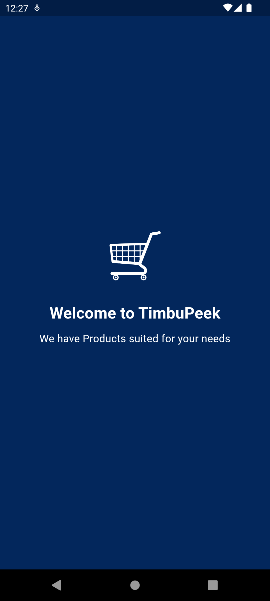
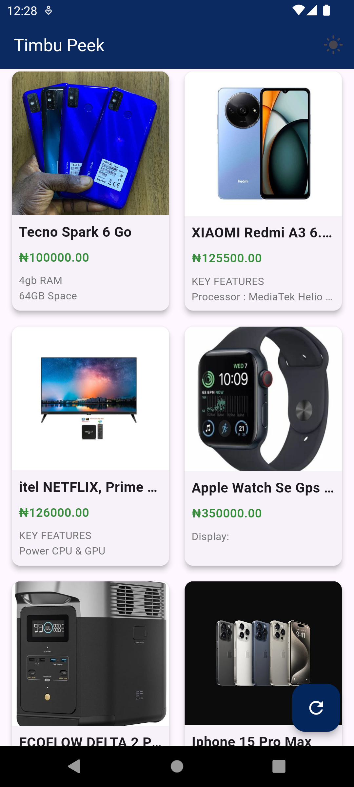
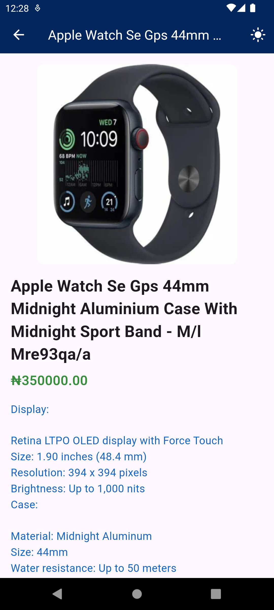

# TimbuPeek

A Product Catalogue just for you.

## Table of Contents

- [Introduction](#introduction)
- [Features](#features)
- [Screenshots](#screenshots)
- [Setup Instructions](#setup-instructions)
- [Appetize.io Demo](#appetizeio-demo)
- [APK Download Link](#apk-download-link)
- [Dependencies](#dependencies)
- [Usage](#usage)
- [License](#license)

## Introduction

TimbuPeek is a mobile application that displays a list of products fetched from the Timbu API. The app features a user-friendly and intuitive interface, supporting both light and dark themes. Users can click on a product to view detailed information, including a larger image, the full name, price, and description.

## Features

- Displays a list of products fetched from the Timbu API.
- Supports light and dark themes.
- Clickable product cards to view detailed information.

## Screenshots





## Setup Instructions

1. **Clone the repository:**

    ```bash
    git clone https://github.com/ioabdullahi/timbu_peek.git
    cd timbu_peek
    ```

2. **Install dependencies:**

    ```bash
    flutter pub get
    ```

3. **Generate native splash screen:**

    ```bash
    flutter pub run flutter_native_splash:create
    ```

4. **Run the application:**

    ```bash
    flutter run
    ```

## Appetize.io Demo

[View the demo on Appetize.io](https://appetize.io/app/android/com.example.timbu_peek?device=pixel7&osVersion=13.0)

## APK Download Link

[Download the APK](https://drive.google.com/file/d/1w2ixmLNFommcgX9oOMcsN7etuDbaIqdA/view?usp=drive_link)

## Dependencies

- Flutter SDK
- GetX
- HTTP
- Flutter Native Splash

## Usage

1. **Toggle Theme:**
   - Click the theme switch button in the app bar to switch between light and dark themes.

2. **View Products:**
   - The home screen displays a grid of products fetched from the Timbu API.
   - Click on any product card to view detailed information about the product.

## License

This project is licensed under the HNG License.